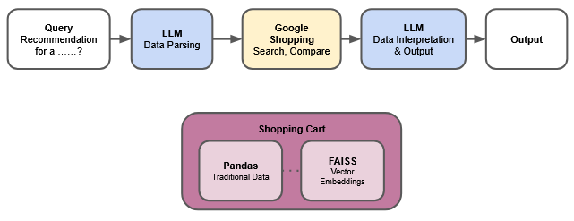

# Shopping AI Agent

User query is parsed by the LLM (Qwen 2.5B) to extract information and return it in JSON format. The information is then used to search relevant results using Google Search API, and the results are summarized again using the LLM to be read more comfortably.

[Demo showcase](https://youtu.be/mPPo9VBDP_khttps://youtu.be/mPPo9VBDP_k)
